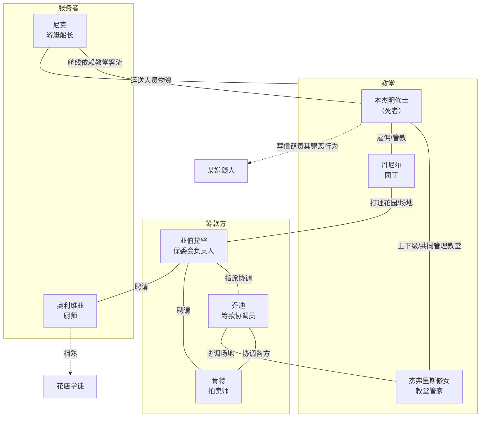

# 安全港的女士们 — 关系图

```mermaid
graph TD
    subgraph 教堂
        本杰明修士["本杰明修士<br/>（死者）"]
        杰弗里斯修女["杰弗里斯修女<br/>教堂管家"]
        丹尼尔["丹尼尔<br/>园丁"]
    end

    subgraph 筹款方
        亚伯拉罕["亚伯拉罕<br/>保委会负责人"]
        乔迪["乔迪<br/>筹款协调员"]
        肯特["肯特<br/>拍卖师"]
    end

    subgraph 服务者
        尼克["尼克<br/>游艇船长"]
        奥利维亚["奥利维亚<br/>厨师"]
    end

    本杰明修士 ---|上下级/共同管理教堂| 杰弗里斯修女
    本杰明修士 ---|雇佣/管教| 丹尼尔
    本杰明修士 -.->|写信谴责其罪恶行为| 嫌疑人A["某嫌疑人"]
    丹尼尔 ---|打理花园/场地| 亚伯拉罕
    亚伯拉罕 ---|指派协调| 乔迪
    亚伯拉罕 ---|聘请| 肯特
    亚伯拉罕 ---|聘请| 奥利维亚
    乔迪 ---|协调各方| 肯特
    乔迪 ---|协调场地| 杰弗里斯修女
    尼克 ---|运送人员物资| 教堂
    奥利维亚 -.->|相熟| 钩子3["花店学徒"]
    尼克 ---|航线依赖教堂客流| 本杰明修士
```
