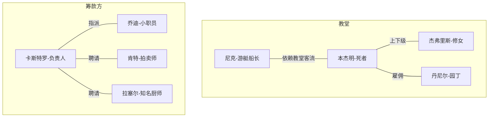

# 嫌疑人关系图

```mermaid
graph TB
    subgraph 教堂
        本杰明-死者 ---|上下级| 杰弗里斯-修女
        本杰明-死者 ---|雇佣| 丹尼尔-园丁
        尼克-游艇船长 ---|依赖教堂客流| 本杰明-死者
    end

    subgraph 筹款方
        卡斯特罗-负责人 ---|指派| 乔迪-小职员
        卡斯特罗-负责人 ---|聘请| 肯特-拍卖师
        卡斯特罗-负责人 ---|聘请| 拉塞尔-知名厨师
        尼克-游艇船长
    end
```
