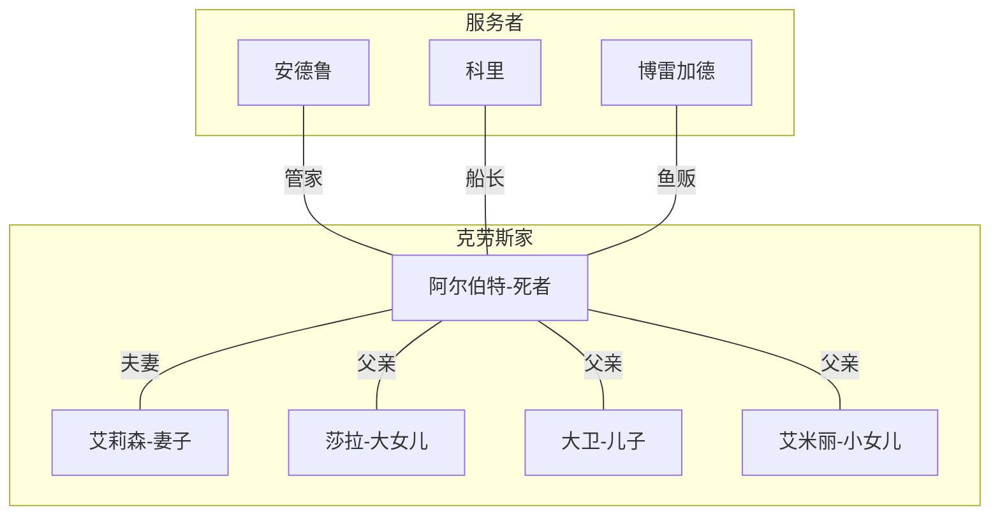

# 嫌疑人关系图

```mermaid
graph TB
    subgraph 克劳斯家
        阿尔伯特-死者 ---|夫妻| 艾莉森-妻子
        阿尔伯特-死者 ---|父亲| 莎拉-大女儿
        阿尔伯特-死者 ---|父亲| 大卫-儿子
        阿尔伯特-死者 ---|父亲| 艾米丽-小女儿
    end

    subgraph 服务者
        安德鲁
        科里
        博雷加德
    end

    安德鲁 ---|管家| 阿尔伯特-死者
    科里 ---|船长| 阿尔伯特-死者
    博雷加德 ---|鱼贩| 阿尔伯特-死者
```
